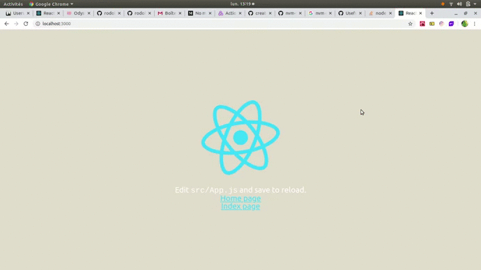

### BluePrint template React 

## Janvier 2020
 

**(FrontEnd => React, styled components and Redux)**


[Demo](#demo)

-  [Movie](#movie-demo)


[Author](#author)

[License](#license)

[Start Project](#Start-project)

---
## Demo
---
### Movie Demo



---

## Tech Stack

 **You must have at minimun these versions for greats performances and good compatibility**

 **Version of Node js**
-    v10.17.0 minimun

---  

## Author 

- Rodolphe Augusto 

--- 

## License  

- MIT.

---

## Start project


- Clone or download this repo https://github.com/rodolphe37/BluePrint-react-redux-styled-components.git
 
- For install node version : 
- ``` $ nvm use ```

 Do in the console :

-  ``` $ cd BluePrint-react-redux-styled-components```

to going to our frontend folder, then doing:

-  ```  $ npm i``` or ``` $ npm install ```

to install the dependencies and

-  ``` $ npm start```

to start  frontEnd project.

  

enjoy!!!
